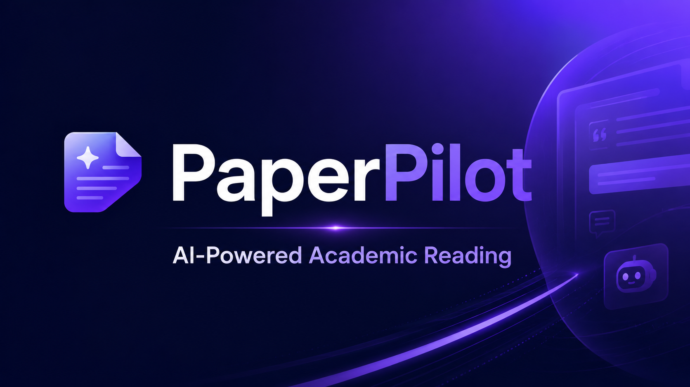

[English](README_EN.md) | **中文**

<p align="center">
  
</p>

<p align="center">
  <b>PaperPilot</b> — An AI Agent Skill for academic paper reading, annotation, translation & knowledge management through conversation.
</p>

---

## What is this

PaperPilot is a **Claude Code Skill**: just give natural language instructions in the Agent dialog, and the Agent will automatically parse papers, generate multi-level summaries, translate paragraph-by-paragraph, and organize into categories. No buttons to click — **conversation is the interface**.

## Features

- **Three-tier Reading**
  - Tier 1 (Summary): AI-generated ≤1000-word Chinese summary + figure sidebar
  - Tier 2 (Deep Analysis): Section-by-section explanation + embedded figures + KaTeX formulas
  - Tier 3 (Original + Translation): PDF rendering on the left + paragraph-aligned Chinese translation on the right
- **Smart Preprocessing**: One sentence to call MinerU API → extract paragraphs/figures/formulas → parallel generation of summary/analysis/translation
- **Text Annotation**: Highlight / underline / comment / ask Agent
- **Category Management**: Hierarchical folders + drag-and-drop + conversational smart archiving
- **Citation Articles**: Agent recursively reads all paper summaries and generates cross-referenced overviews
- **Math Rendering**: KaTeX support for `$...$` and `$$...$$`
- **Browser Upload**: Upload PDF directly from homepage, or place in `data/origin/` and Rescan

## Quick Start

### Option 1: Let the Agent install for you (Recommended)

In the Claude Code dialog, just say:

```
Install PaperPilot skill, repo: https://github.com/vinsontang1/PaperPilot
```

The Agent will automatically: clone repo → install dependencies → register Skill → guide you through MinerU Token setup → start the server.

### Option 2: Manual installation

**1. Clone**

```bash
git clone https://github.com/vinsontang1/PaperPilot.git
cd PaperPilot
```

**2. Install Python dependencies**

```bash
pip install -r requirements.txt
```

Requires Python 3.10+.

**3. Configure MinerU API Token**

PDF parsing is powered by [MinerU](https://mineru.net/) cloud service (free: 1000 pages/day).

```bash
# 1. Sign up: https://mineru.net/
# 2. Copy Token: https://mineru.net/apiManage/token
# 3. Set environment variable:
export MINERU_TOKEN='paste your token here'

# Recommended: persist in shell config
echo "export MINERU_TOKEN='your_token'" >> ~/.bashrc && source ~/.bashrc
```

**4. Register Skill**

```bash
mkdir -p ~/.claude/skills
ln -sf "$(pwd)/skill" ~/.claude/skills/paper_pilot
```

**5. Start the server**

```bash
bash start.sh
```

Open http://127.0.0.1:7856/ in your browser, then tell the Agent "process the latest paper" to get started.

## Chat Examples

**Preprocess a paper**

```
User: Process the latest unprocessed paper

Agent: Found 1 unprocessed paper: 2403-14144v2.pdf
       Calling MinerU to parse (10 pages)...
       Extracted 172 paragraphs + 8 figures
       Title: Understanding the Ranking Loss for Recommendation with Sparse User Feedback
       Generating summary/analysis/translation in parallel...
       ✅ Done! Where to archive?
       → recommendation/losses (Recommended)
       → Create new category
       → Skip archiving

User: recommendation/losses

Agent: ✅ Archived to recommendation/losses
```

**Smart archiving**

```
User: Archive all unfiled papers

Agent: Found 3 unfiled papers, analyzing...
       1. ThinkRec → recommendation/llm4rec ✅
       2. SlideCoder → document-generation/slides ✅
       3. OpenOneRec → recommendation/llm4rec ✅
```

**Category overview**

```
User: Summarize all papers under the recommendation category

Agent: Read 3 paper summaries, generating citation article...
       ✅ Written to recommendation homepage
```

**Move a paper**

```
User: Move ThinkRec to recommendation/llm4rec

Agent: ✅ Moved
```

## Project Structure

```
PaperPilot/
├── skill/                     # Skill docs (Agent reads these to work)
│   ├── SKILL.md               # Entry: triggers + rules + method index
│   └── methods/               # 12 method files
│       ├── preprocess.md      # Preprocessing pipeline
│       ├── classify.md        # Smart classification
│       ├── archive.md         # Batch archiving
│       ├── answer-question.md # Answer annotation questions
│       ├── folder-analysis.md # Category citation articles
│       ├── _prompt-*.md       # Sub-agent prompt templates
│       └── api-reference.md   # REST API contract
├── server/                    # FastAPI backend
├── web/                       # Frontend (Tailwind + KaTeX + PDF.js)
├── scripts/
│   ├── mineru_extract.py      # MinerU API adapter
│   └── preprocess_paper.py    # One-click preprocessing script
├── data/                      # User data
├── start.sh / stop.sh
├── requirements.txt
└── figs/                      # README images
```

## Tech Stack

| Layer | Technology |
|-------|-----------|
| Backend | Python 3.10+ / FastAPI / Uvicorn |
| Frontend | Vanilla JS / Tailwind CSS (CDN) / PDF.js / KaTeX / Marked.js |
| PDF Parsing | MinerU API (VLM model) |
| AI Integration | Claude Code Skill Protocol |
| Storage | Local JSON files (no database) |

## Environment Variables

| Variable | Required | Description |
|----------|----------|-------------|
| `MINERU_TOKEN` | Yes | MinerU API Token. Get it at: https://mineru.net/apiManage/token |

## License

MIT
